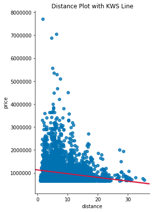

<span style="font-size:24pt; font-weight:bold">Module 2 Project: King County Homes</span><br>

<br><center><h3>The focus for this project was higher priced homes in King County, Washington.</h3><br>
King County has the distinction of the only county in the United States named for Dr. Martin Luther King, Jr.

<br>


<details><summary><span style="font-size:18pt; font-weight:bold">Outline</span><br></summary>
    
* Overview and Goals
* Scrub
* EDA
* Distance from Seattle
* Model
* Interesting Features
* Conclusion
</details>

<details><summary><span style="font-size:18pt; font-weight:bold">Overview and Goals</span><br>
&emsp;This project required an assessment of high-end homes in King County Washington through data exploration.<br></summary>
    
# Goals
The overall goal of this project is to find useful insights while practicing exploratory data analysis. 
Our premise is to investigate the available data to assist Lifestyles Inc., high-end purchasing assistants, with data on higher priced homes. 
    
Dataset provided for exploration: kc_house_data.csv

</details>


<details><summary><span style="font-size:18pt; font-weight:bold">Scrub</span><br>
&emsp;Clean the King County homes dataset.<br></summary>
    
# Initial Data Observations and Treatments
* Several sets of categorical data : waterfront (binary), view, condition, grade, zip code
* Removed NAs by changing them to 0s, keeping in mind these placeholders will affect analysis
* Changed '?' to 0s
* Formatted the date as mm/dd/yyyy without time stamps (affected duplicates)
* Removed < 10 duplicate rows

</details>

<details><summary><span style="font-size:18pt; font-weight:bold">EDA</span><br>
&emsp;Analyze the King County homes dataset.<br></summary>
    
# Observations
* Price had significant outliers in higher priced homes. However, since the focus was on higher priced homes, these outliers were kept.<br>


<br><br><br><br><br><br><br><br><br><br><br><br><br><br><br>

* Using descriptive statistics Q3 was found and a dataframe was created with the upper 25% of home prices.
<br><br>


<br>

## Interesting features from pairwise plot

<br>

* Categorical data values:  bedrooms, floors, waterfront, view, condition, grade, and not as obvious bathrooms.
* Binary features: waterfront
* Features with too many '0' values: yr_renovated, sqft_basement, view, and waterfront
* Significantly skewed features: sqft_lot15, yr_built, sqft_basement, and price
* Zip Code and grade have two distinct sections: zip (980XX and 981XX), grade (bimodal with few values in the middle at 5 & 6)
* Somewhat linear relationships with price: sqft_living and sqft_above
* sqft_above and sqft_living are highly correlated to each other - may present collinearity
* Other interesting features: bathroom and grade

</details>

<details><summary><span style="font-size:18pt; font-weight:bold">Distance from Seattle</span><br>
&emsp;Analyze the price of homes compared to the distance from Seattle.<br></summary>
    
# Distance from downtown jobs and activities
<br>
<br>

* Note in the plot above the highest priced homes are the closest to Seattle with significant drop off as homes are located farther from the city. <br>
* From the plot below it is evident the distribution is not normal. However, there seems to be a linear relationship with distance. The given plot would also show a shaded confidence interval about the line if there were a spread of data.<br>


</details>

<details><summary><span style="font-size:18pt; font-weight:bold">Model</span><br>
&emsp;Analyze features to predict price of King County homes.<br></summary>
    
# Modeling
* Using a cross validation function a baseline was created.
* A pairwise comparison function determined the following key combinations to explore:
    * sqft_living and grade
    * sqft_living and distance
    * bathrooms and grade


* The skew score of 1.17 suggests a slight positive skew to the distribution, but still well within the bounds of normality.
* The kurtosis score of 11.2 indicates some extreme values in the tail, which we know are some of the highest priced homes.
* The p-values are all below 0, meaning that there is virtually no chance that the null-hypothesis is true (null-hypothesis being that random chance resulted in the data set and no real correlation between variables exists).
* The F-statistic of 24,610 is immense and it's probability score is 0.00. This means that the variance between the groups is large while the variance within the groups is desirably small. The probability against refers to the chance that what we're seeing is actually unrelated to our variables i.e. is no chance the null hypothesis is true.
* The Jarque-Bera (JB) score is an enormous 16350. We ideally want a very low JB. Because the sample size plays into the actual score, this number can get inflated quickly. However, considering that the first JB score we saw was around 28,723.55, which is an improvement. The JB test is a goodness-of-fit test to see if our sample data has a skew and kurtosis matching a true normal distribution. We are aware of the skew and kurtosis.
* The Coefficient of Determination  𝑅2  score is 0.90 which essentially means that approximately 90% of the variance in a house's sale price can be predicted by the variables in the model we have created.
* The Variance Inflation Factor (VIF) score of 10.13 provides an index measuring how much the variance of an estimated regression coefficient is increased because of collinearity. This value is higher than desired.
## The overall scores and graphical representations provide only moderate predictability.
</details>

<details><summary><span style="font-size:18pt; font-weight:bold">Interesting Features</span><br>
&emsp;Other features to predict price of King County homes.<br></summary>
    
# Grade
* The graph illustrates how grade affects the price of homes
* As grade increases the price of the home is also likely to increase


# Waterfront
* Although there weren't many waterfront homes represented in the initial data, 85% of these homes are higher priced.
* 124 out of 146 homes are higher priced homes.


</details>

<details><summary><span style="font-size:18pt; font-weight:bold">Conclusion</span><br>
&emsp;What have we learned about King County homes?<br></summary>
    
# Key Recommendations
If you're looking for a higher priced home in King County Washington you'll likely find one 
* closer to Seattle, possibly in the Bellevue area
* with a good construction grade
* having a home with at least 2880 sq ft
* If a waterfront home is desired, most are higher priced.


# Future Options
* Future data analysis should include school zones.
* Further analysis could be made of moderately priced homes.
</details>


```python

```
